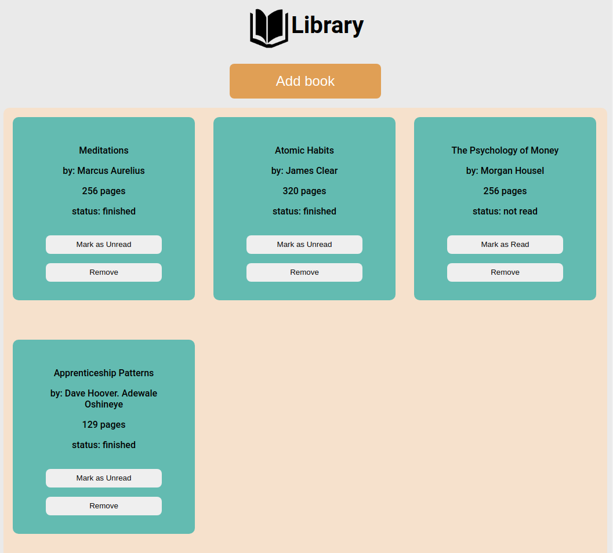

# Library

Application that lets users add books to their reading list and let them mark as "finished" or "not read"

This project was created to learn about Objects and Object Constructors.

**Link to project:** https://brianbud.github.io/library/

## Lessons Learnt:

- used the dialog element.
- Working with Objects and Object Contructors.
- using `checkValidity()` method.
- using Dynamix text values based eg. "mark as read" button.
- data attributes to select the specific card to remove.
